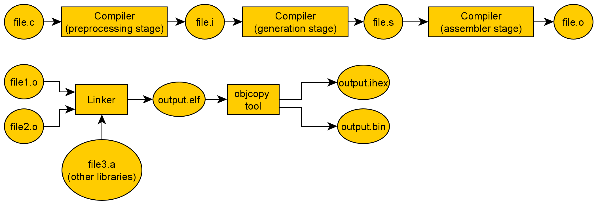
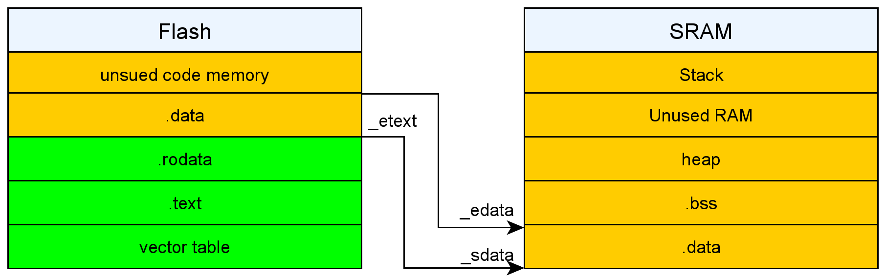
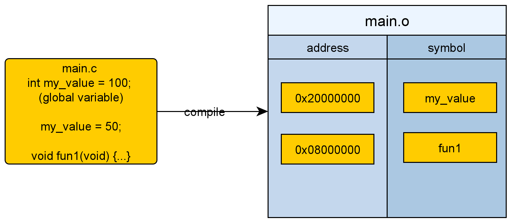
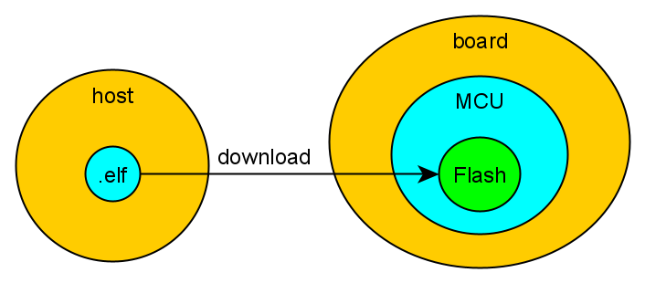
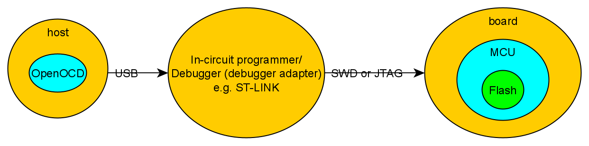
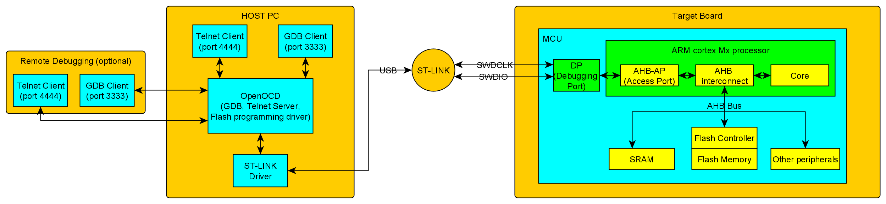
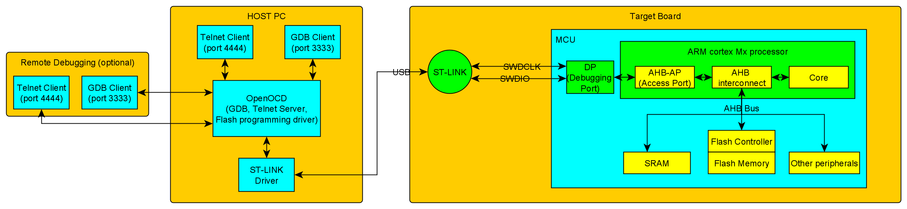
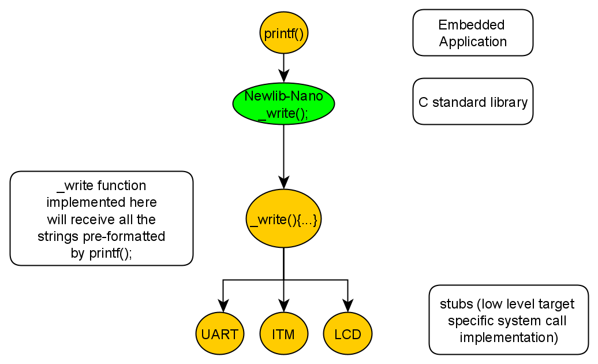
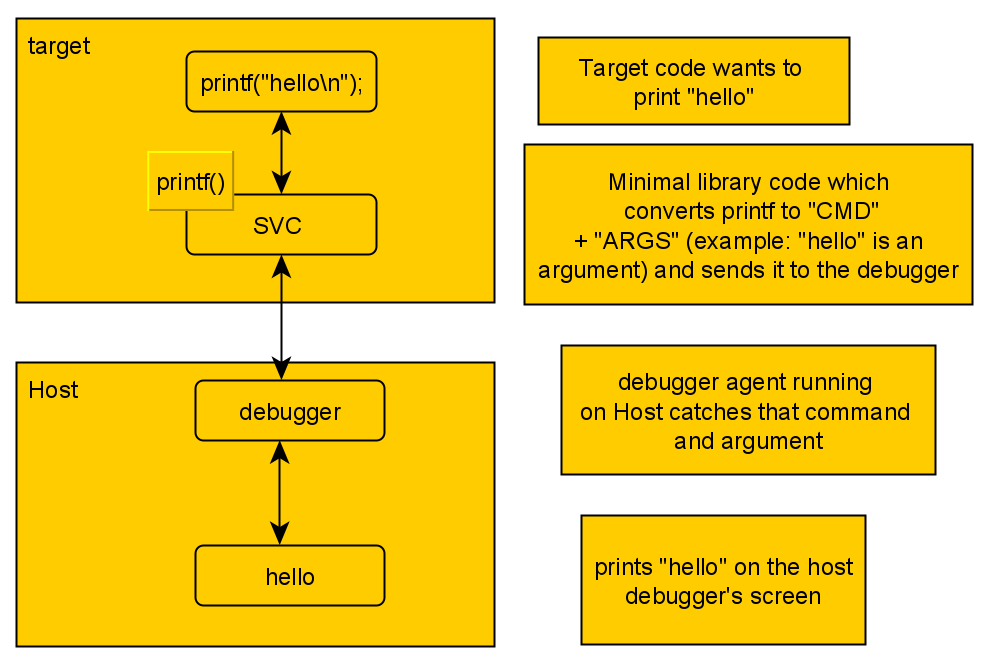

# build process


## Acknowledgment

<a href="https://www.youtube.com/channel/UCa1REBV9hyrzGp2mjJCagBg">Fastbit Embedded Brain Academy </a> YouTube channel.

<a href="https://youtube.com/playlist?list=PLERTijJOmYrDiiWd10iRHY0VRHdJwUH4g">Bare metal embedded Playlist</a>

## Cross tool chain important binaries
### arm-none-eabi-gcc
It's a compiler, linker and assembler.

#### common compiler flags:
<a href="https://gcc.gnu.org/onlinedocs/gcc/Option-Summary.html">GNU reference</a>
<ul>
  <li>
    <code>-o</code> to specifiy the name of the output file. If it's not specified, the default name is a.out
  </li>
  <li>
    <code>-c</code> compile or assemble but don't link
  </li>
  <li>
    <code>-march=name</code> to specifiy the ARM architecture.
  </li>
  <li>
    <code>-mcpu=name</code> to specify the processor name. In this case it's not nessary to specify the ARM architecure.
  </li>
  <li>
    <code>-mthump</code>ARM or Thump state. (modern processors architecture is thump ISA, so choose -mthump).
  </li>
  <li>
    <code>-S</code> generate assembly file only and don't assemble.
  </li>
  <li>
    <code>-std=</code>determine the C standard.
  </li>
  <li>
    <code>-O</code> determine the optimization level.
  </li>  
  <li>
    <code>-Wl</code> to specify a flag for the linker. syntax: <code>-Wl,-Map=final.map</code>
  </li> 
  <li>
    <code>-g</code> Produce debugging information in the operating system’s native format (stabs, COFF, XCOFF, or DWARF). GDB can work with this debugging information. 
  </li> 
  <li>
    <code>-Wall</code> enable all warnings detction.
  </li>
  <li>
    <code>-MD</code>
    Output a rule suitable for make describing the dependencies of the main source file. The preprocessor outputs one make rule containing the object file name for that source file, a colon, and the names of all the included files, including those coming from -include or -imacros command-line options. Give the dependency file the name of the output with extension .d (this is the purpose of D in MD).
    <a href="https://www.gnu.org/software/make/manual/html_node/Automatic-Prerequisites.html">Reference</a>
  </li>
  <li>
    <code>-MMD</code>
    Like -MD except mention only user header files, not system header files. 
  </li>
</ul>


### arm-none-eabi-ld
It's a linker.
#### common linker flags:
<ul>
  <li>
    <code>-T</code> to specify the linker script.
  </li>
  <li>
    <code>-nostdlib</code> to not use standard library.
  </li>
  <li>
    <code>-Map=final.map</code> to generate a map file.
  </li>
</ul>

### arm-none-eabi-as
It's an assembler.
### arm-none-eabi-objcopy
It's a format converter to change from executable format to another executable format.
### arm-none-eabi-objdump
To dump an object file e.g. main.o
#### common flags:
<ul>
  <li>
    <code>-h</code>(headers)display the contents of the section headers.
  </li>
  <li>
    <code>-d</code>(disassemble)display the assembler contents of the executable sections.
    ```
    arm-none-eabi-objdump -d main.o > main_log
    ```
  </li>
  <li>
    <code>-s</code>(full-content)display the full contents of all sections requested. 
  </li>
</ul>

### arm-none-eabi-readelf

### arm-none-eabi-nm
To see all the symbols of ELF file.

## Makefile
### rule
A rule appears in the makefile and says when and how to remake certain files, called the rule’s <i>targets</i> (most often only one per rule). It lists the other files that are the <i>prerequisites</i> of the target, and the <i>recipe</i> to use to create or update the target.

```
target: dependency

main.o: main.c
```
### default goal
If you don't specify a target to make. The chosen target will be the target of the first rule.
<code>make</code>(not specifying a target).

### phony targets
A phony target is one that is not really the name of a file; rather it is just a name for a recipe to be executed when you make an explicit request.

```
.PHONY: clean
clean:
        rm *.o temp
```

### recipes
The recipe of a rule consists of one or more shell command lines to be executed, one at a time, in the order they appear.
```
main.o: main.c
        $(CC) $(CFLAGS) main.c -o main.o (recipe)
```

### variables 
A variable is a name defined in a makefile to represent a string of text, called the variable’s value. It's case senesitive and conventionally upper case.

To dereference a variable use <code>$(VAR)</code>

### automatic variables
Suppose you are writing a pattern rule to compile a ‘.c’ file into a ‘.o’ file: how do you write the ‘cc’ command so that it operates on the right source file name? You cannot write the name in the recipe, because the name is different each time the implicit rule is applied.

What you do is use a special feature of make, the automatic variables. These variables have values computed afresh for each rule that is executed, based on the target and prerequisites of the rule. In this example, you would use ‘$@’ for the object file name and ‘$<’ for the source file name.

It's used only in recipes.
<ul>
  <li>
    <code>$@</code>: The file name of the target of the rule.
  </li>
  <li>
    <code>$^</code>: The names of all the prerequisites, with spaces between them.
  </li>
  <li>
    <code>$<</code>: The name of the first prerequisite.
  </li>
</ul>

### how patterns match
A target pattern is composed of a ‘%’ between a prefix and a suffix, either or both of which may be empty. The pattern matches a file name only if the file name starts with the prefix and ends with the suffix, without overlap. The text between the prefix and the suffix is called the stem. Thus, when the pattern ‘%.o’ matches the file name test.o, the stem is ‘test’. The pattern rule prerequisites are turned into actual file names by substituting the stem for the character ‘%’. Thus, if in the same example one of the prerequisites is written as ‘%.c’, it expands to ‘test.c’.
```
%.o: %.c
        $(CC) -c $(CFLAGS) $(CPPFLAGS) $< -o $@
```

### Analyzing .o filies (Relocatable object files)
A file format standard describes a way of organizing various elements (data, read-only data, code, uninitialized data, etc.) of a program in different sections.
#### ELF (executable and linkable format)
ELF is a standard file format for object files and executable files when you use GCC.

#### Other formats:
<ul>
  <li>
    (Common Object File Format) COFF: introduced by Unix SystemV.
  </li>
  <li>
    (Arm Image Format) AIF: introduced by ARM.
  </li>
  <li>
    SRECORD: introduced by Motorola.
  </li>
</ul>

main.o doesn't include any <strong>absolute addresses</strong> for data and code. If you disassembled the content using objdump tool, you'll find that every section starts at 0 address in memory, that's why it's called relocatable (they will be relocated later by the linker using the linker script).

#### sections:
##### .text
It holds the code or the instructions of the program.
##### .data
It holds the initialized global variables.
##### .bss
It holds the static uninitialized global variables.
##### .common 
It holds the non-static uninitialized global variables.
##### .rodata
It holds the read-only data of the program.
#### User defined sections
You can add your own sections.

## startup file
### Importance of startup file
- The startup file is responsible for setting up the right environment for the main user code to run.
- Code written in startup file runs before main(). So you can say startup file calls main().
- Some part of the startup code file is the target (Processor) dependent.
- Startup code takes care of vector table placement in code memory as required by the ARM cortex Mx processor.
- Startup code may also take care of stack reinitialization. 
- Startup code is responsible of .data, .bss section initialization in main memory.



### startup file components
- A vector table for your microcontroller. Vector tables are MCU specific.
- .data, .bss sections initialization in SRAM.
- main function call.

### language of the startup file
- C
- assembly

### 1-vector table
An array of integers that should be located in the right position in memory and not in .data section. This can be achieved with compiler attribute <code>section ("section-name")</code>.
```C
uint32 vector[] __attribute__((section (".isr_vector"))) = 
{MSP, vector_table_address1, vector_table_address2...};
```

#### compiler attributes</a>
<a style="text-decoration: none" target="_blank" href="https://gcc.gnu.org/onlinedocs/gcc/Variable-Attributes.html">GCC reference </a>
The keyword ```__attribute__``` allows you to specify special properties of variables, function parameters, or structure, union, and, in C++, class members. This __attribute__ keyword is followed by an attribute specification enclosed in double parentheses. Some attributes are currently defined generically for variables. Other attributes are defined for variables on particular target systems. Other attributes are available for functions (see Function Attributes), labels (see Label Attributes), enumerators (see Enumerator Attributes), statements (see Statement Attributes), and for types (see Type Attributes). Other front ends might define more attributes (see Extensions to the C++ Language).

##### variable attributes
<ul>
  <li>
      <code>section ("section-name")</code> Normally, the compiler places the objects it generates in sections like data and bss. Sometimes, however, you need additional sections, or you need certain particular variables to appear in special sections, for example to map to special hardware. The section attribute specifies that a variable (or function) lives in a particular section.
  </li>
</ul>

##### functions attributes
<ul>
  <li>
    <code>Alias</code> It allows to give alias name for a function.
    <br>
    <code>
    void NMI_Handler(void) __attribute__((alias("Default_Handler")));
    </code>
  </li>
  <li>
    <code>weak</code> It allows to override already defined weak function(dummy), with the same function name.
    <br>
    <code>
    void NMI_Handler(void) __attribute__((weak, alias("Default_Handler")));
    </code>
  </li>
</ul>

### 2-.data, .bss initialization
To get the .data section from flash, you should know the boundaries of this section in flash. The linker script passes this boundaries to the startup file.

### 3-initialize 'C' std library
You should declare and call a standard library function:
```C
__libc_init_array();
```
### 4-declare and call the main function
```C
main();
```

## Linker script
- Linker script is a text file which explains how different sections of the object files should be merged to create an output file.
- Linker and locator combination assigns unique absolute addresses to different sections of the output file by referring to address information mentioned in the linker script.
- Linker script also includes the code and data memory address and size information.
- Linker script are written using <strong>GNU linker command language</strong>
- GNU linker script has the file extension of .ld
- You must supply linker script at the linking phase to the linker using <code>-T</code> option

### Important linker script commands
<ul>
  <li>
    <code>ENTRY</code> 
    <br>
    <ul>
      <li>
        This command is used to set the <strong>Entry point address</strong> information in the header of the final ELF file generated.
      </li>
      <li>
        In our case, <strong>Reset_Handler</strong> is the entry point into the application. The first piece of code that executes right after the processor reset.
      </li>
      <li>
        The debugger uses this information to locate the first function to execute.
      </li>
      <li>
        Not a mandatory command to use, but required when you debug the ELF file using the debugger (GDB).
      </li>
      <li>
        Syntax <code>ENTRY(_symbol_name_)</code> <br>
        e.g. <code>ENTRY(Reset_Handler)</code>
      </li>
    </ul>
  </li>
  <li>
    <code>MEMORY</code> 
    <ul>
      <li>
        This command allows you to describe the different memories present in the target and their start address and size information.
      </li>
      <li>
        The linker uses information mentioned in this command to assign addresses to merged sections.
      </li>
      <li>
        The information is given under this command also helps the linker to calculate total code and data memory consumed so far and throw an error message if data, code, heap or stack areas can't fit into available size.
      </li>
      <li>
        By using memory command, you can fine-tune various memories available in your target and allow different sections to occupy different memory areas.
      </li>
      <li>
        Typically one linker script has one memory command.
      </li>
      <li>
        syntax 
        <br>
        <code>MEMORY</code>
        <br>
        <code>{</code>
        <br>
        <code>name(attr):ORIGIN =origin, LENGTH =len</code>
        <br>
        <code>}</code>
        <ul>
          <li>
            name: defines the name of the memory region which will be later referenced by other parts of the linker script. A name has its own optional attribute list <code>attr</code>
          </li>
          <li>
            ORIGIN: defines the origin address of the memory region.
          </li>
          <li>
            LENGTH: defines the length information.
          </li>
          <li>
            attr: defines the attribute list of the memory region. Valid attribute lists must be made up of the characters "ALIRWX" or "alirwx" that match section attributes.
            <ul>
              <li>
                R: Read-only sections.
              </li>
              <li>
                W: Read and write sections.
              </li>
              <li>
                X: Sections containing executable code.
              </li>
              <li>
                A: Allocated sections.
              </li>
              <li>
                I/L: Initialized sections.
              </li>
              <li>
                !: Invert the sense of any of the following attributes.
              </li>
            </ul>
          </li>
        </ul> 
      </li>
      <li>
        example:
        <br>
        <code>MEMORY</code>
        <br>
        <code>{</code>
        <br>
        <code>FLASH(rx):ORIGIN =0x08000000, LENGTH =1024K</code>
        <br>
        <code>SRAM(rwx):ORIGIN =0x20000000, LENGTH =128K</code>
        <br>
        <code>}</code>
      </li>
    </ul>
  </li>
  <li>
    <code>SECTIONS</code> 
    <ul>
      <li>
        SECTIONS command is used to create different output sections in the final ELF executable generated.
      </li>
      <li>
        Important command by which you can instruct the linker how to merge the input sections to yield an output section.
      </li>
      <li>
        This command also controls the order in which different output sections appear in the ELF file generated.
      </li>
      <li>
        By using this command, you also mention the placement of a section in a memory region. For example, you instruct the linker to place the .text section in the FLASH memory region, which is described by the MEMORY command.
      </li>
      <li>
        syntax<br>
        <code>SECTIONS</code><br>
        <code>{</code><br>
        <code>.text :</code><br>
        <code>{</code><br>
        <code>//body</code><br>
        <code>//This section should include .text, .isr_vector, and .rodata section of all input files</code><br>
        <code>*(.isr_vector)</code><br>
        <code>*(.text)</code><br>
        <code>*(.rodata)</code><br>
        <code>_etext = .;</code><br>
        <code>}</code><br>
        <code>}> VMA AT> LMA</code><br>
        <ul>
          <li>
            .text: name of the section
          </li>
          <li>
            > VMA AT> LMA: gives information to the linker where this section is in the memory. VMA->virtual memory address, LMA->locatable memory address. e.g. for .text section VMA and LMA are equal to FLASH. In this case, you can just mention the VMA and the linker infers that the LMA is similiar (> FLASH). For SRAM, it's locatable area is in FLASH, but the absolute address (virtual address) is in SRAM (> SRAM AT> FLASH).
          </li>
          <li>
            *(.text): merge .text section of all input files, * is a wildcard.
          </li>
        </ul>
      </li>
    </ul>
  </li>
  <li>
    <code>ALIGN</code> 
    To align a specific variable on a specific boundary. <code>. = ALIGN(4)p;</code> Align the location counter on a word boundary.
  </li>
  <li>
    <code>KEEP</code> 
    Force the linker to keep some specific sections even if they're not referenced. For example, it's used with <code>.isr_vector</code> section because it should be included in all cases.
  </li>
  <li>
    <code>AT></code>
    To specify the LMA (locatable memory address).
  </li>
</ul>

### Linker script symbol 
- A symbol is the same of an address.
- A symbol declaration is not equivalent to a variable declaration what you do in you 'C' application.


example: <br>
__max_stack_size = 0x200; 

- To import the symbol from the startup file <br>
<code>extern uint32_t __max_stack_size;</code><br>
<code>uint32_t temp =  &__max_stack_size;</code><br>
You should access the symbol with <code>&</code> because it's an address and not a value.
- If you want to see all the symbols of the ELF file, use <code>arm-none-eabi-nm</code> tool.

### Location counter (.)
- This is a special linker symbol denoated by a dot '.'
- This symbol is called "location counter"since linker automatically updates this symbol with location (address) information.
- You can use this symbol inside the linker script to track and define boundaries of various sections.
- You can also set location counter to any specific value while writing linker script.
- Location counter should appear only inside the SECTIONS command.
- The location counter is incremented by the size of the output section.
- Location counter always tracks VMA of the section in which it's being used.

### map file
- It shows the memory map and where all the sections are placed.
- To know the addresses of the functions.
- The linker will fill bytes to align only the <strong>internal parts</strong> of a section. 

example:
```
*(.text)
0x08000762 Reset_Handler
*(.rodata) 
*fill* 0x0800076e 2
0x08000770 0x9 main.o
```

- But it will not align the beginning or the end of the section. So, you need to use <code>ALIGN</code>. <br>
e.g. <code> . = ALIGN(4);</code> which means to align the location counter on the next 4 bytes (word) boundary.
- A rule of thump: before ending any section, make sure the location counter is aligned.

## Downloading and debugging executable



### OpenOCD
- Open On-Chip Debugger (OpenOCD) aims to provide debugging, in-system programming, and boundary-scan testing for embedded target devices.
- It's free and opensource host application allows you to program, debug and analyze your application using GDB.
- It supports various target boards based on different processor architecture.
- OpenOCD currently supports many types of debug adapters: USB-based, pararllel port-based, and other standalone boxes that run OpenOCD internally.
- GDB Debug: it allows many ARM architectures to be debugged via the GDB protocol.
- Flash Programming

### programming adapters
- programming adapters are used to get access to the debug interface of the target with native protcol signaling such as SWD or JTAG since HOST doesn't support such interfaces.
- It does protocol conversion. For example, commands and messages coming from host application in the form of USB packets will be converted to quivalent debug interface signaling (SWD or JTAG) and vice versa.
- Mainly debug adapter helps you to download and debug the code.
- Some advanced debug adapters will also help you to capture trace events such as on the fly instruction trace and profiling information.

<figure>
  
  <figcaption>prgramming with external ST-LINK programmer</figcaption>
</figure>
<figure>
  
  <figcaption>prgramming with internal/embedded ST-LINK programmer</figcaption>
</figure>

### steps to download the code using OpenOCD
1. Download and install OpenOCD
    1. Download the binaries.
    1. Put the openocd executable in the path.
1. install Telnet client (for windows you can use PuTTY software). If you can't use Telnet application you can use also use "GDB client".
1. Run OpenOCD with the board configuration file.
1. connect to the OpenOCD via Telnet Client or GDB client.
1. Connect to the OpenOCD via Telnet Client or GDB client.
1. Issue commands over Telnet or GDB Client to OpenOCD to download and debug the code.

### OpenOCD configuration file
Add a recipe for the load in the Makefile, it will start OpenOCD listening.
```
load:
        openocd -f board/stm32f4discovery.cfg
```
You can can get the correct configuration file from scripts folder in the openocd folder according to your board.

### connect to OpenOCD using GDB client
run the GDB client
```
arm-none-eabi-gdb.exe 
```
Once it's working, connect to OpenOCD with
```
target remote localhost:3333
```
initialize
```
monitor reset init
```
<code>monitor</code> is used to differentiate between GCD and OpenOCD command. So, it must be used before every OpenOCD command.

#### Flash
```
monitor flash write_image erase final.elf
```
#### Reset then halt the execution of the code.
```
monitor reset halt
```
#### Run the program
```
monitor resume
```
#### Stop the execution
```
monitor halt
```
#### Reset the board
```
monitor reset
```
#### Set a software breakpoint
<code>bp [address len [hw]]</code> sets a breakpoint on code execution starting at address for length bytes. I didn't get what's the length...
```
monitor bp address length 
monitor bp 0x08000000 2 
```

#### to shutdown the connection
```
monitor shutdown
```

#### Set a hardware breakpoint
```
monitor bp 0x08000000 2 hw
```

#### Remove a breakpoint
Command: rbp all | address
Remove the breakpoint at address or all breakpoints.
```
rbp 0x08000000
rbp all
```
### reference
http://openocd.org/doc/html/General-Commands.html

## 'C' standard library newlib & newlib-nano

### Newlib
- Newlib is a 'C' standard library implmentation intended for use on embedded systems, and it's introduced by Cygnus Solutions (now Red Hat).
- "Newlib" is written as Glibc(GNU libc) replacement for embedded systems. It can be used with no OS ("bare metal") or with a lightweight RTOS.
- Newlib ships with GNU ARM toolchain installation as the default C standard library.
- GNU libc (glibc) includes ISO C, POSIX, SystemV, and XPG interfaces. uClibs provides ISO C, POSIX, and SystemV, while Newlib provides only ISO C.
- Location in the tool chain: GNU Arm Embedded Toolchain\10 2020-q4-major\arm-none-eabi\lib 
- name: libc.a
- Semihosting library that is used for console IO operations like printf: librdimon.a
- there're .specs files used to link to this library
### Newlib-nano
- Due to the increased feature set in newlib, it has become too bloated to use on the systems where the amound of memory is very much limited.
- To provide a C library with a minimal memory footprint, suited for use with micro-controlled, ARM introduced newlib-nano based on newlib.
- Location in the tool chain: GNU Arm Embedded Toolchain\10 2020-q4-major\arm-none-eabi\lib 
- name: libc_nano.a
- Semihosting library that is used for console IO operations like printf: librdimon_nano.a
- there's .specs file: <code>nano.specs</code> used to link to this library. For the semihosting <code>rdimon.specs</code>

### Low level system calls
- The idea of Newlib is to implement the hardware-independent parts of the standard C library and rely on a few low-level system calls that must be implemented with the target hardware in mind.
- When you're using newlib, you must implement the system calls appropriately to support devices, file-systems, and memory management.



- To link to the library, add to the linker flags:
```
--specs=nano.specs
```
- <code>-nostdlib</code> should be removed
- You should also include the architecture and the thump state in the linker.
```
-mcpu=&(MACH) -mthump
```
- Linking ot the standard library introduces new sections for example <code>.text.memset</code>. So, they can be merged in the the .text section with 
```
*(.text.*)
```
- If there're sections between the .text and the .data in FLASH, you shouldn't use the end of the .text as the start of the .data section in FLASH. Instead, you should use linker command in the .section which is 
```
_la_data = LOADADDR(.data);
```
- You should specify the floating-point ABI to use in the compiler and linker flags. 'soft', 'softfp' or 'hard'. 'soft' totally software operations. 'hard' all operation is made with the FPU. 'softfp' some software and some with FPU.
```
-mfloat-abi=soft
or
-mfloat-abi=hard
```

## Semi-hosting
Semihosting is a mechanism that enables code running on an ARM target to communicate and use the Input/Output facilities on a host computer that is running a debugger.

- to use it, you should use this flag in the linker:
```
-specs=rdimon.specs
```
Declare and call this function in the main function:
```
initialise_monitor_handles();
```
- You don't need to implement any system calls any more
- After connecting to OpenOCD, to enable the semihosting, you should run
```
monitor arm semihosting enable
```


The debug agent running on HOST catches that command and argument.
